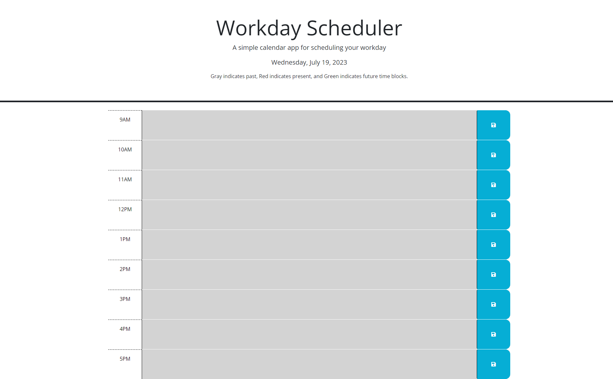

# Workday Scheduler

## Description

A simple and intuitive calendar app for efficient workday scheduling. Color-coded time blocks indicate past, present, and future events. Save tasks with Local Storage for easy access. Stay organized and productive with Workday Scheduler.

## Usage

1. Access the [Workday Scheduler app](https://connorg45.github.io/workday-scheduler/).

2. The page displays the current day and time blocks representing each hour of the workday.

3. Time blocks are color-coded:
   - **Grey**: Past hour
   - **Red**: Current hour (Present)
   - **Green**: Future hours

4. To schedule a task, click inside the textarea of the related hour's time block.

5. Enter the task details and click the save button on the right of the textarea.
## License

Please refer to the LICENSE in the repo.

## Webpage Preview

# Links

[Deployed Website](https://connorg45.github.io/workday-scheduler/)

[Github Repo](https://github.com/connorg45/workday-scheduler)